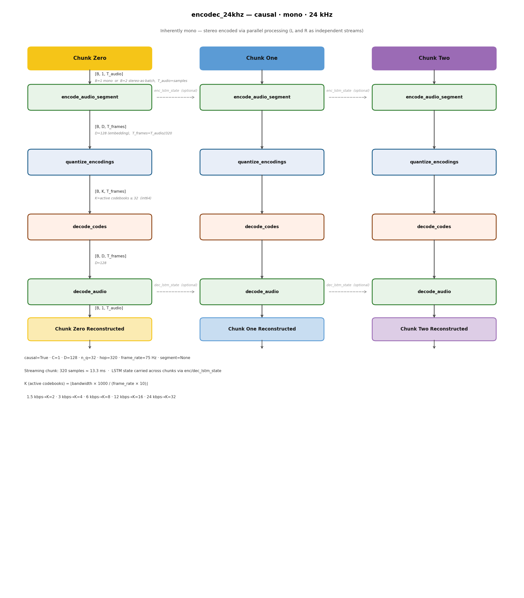
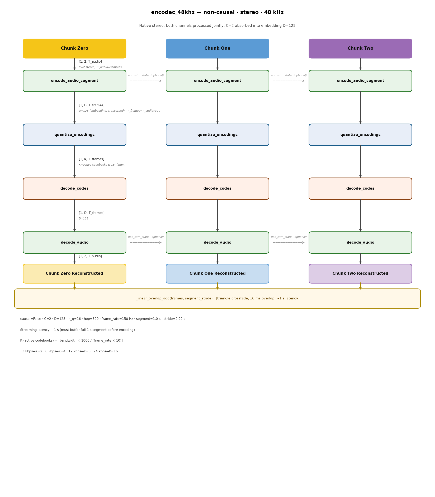

# EnCodec — ONNX Export Fork

Fork of [Meta's EnCodec](https://github.com/facebookresearch/encodec) extended to support ONNX serialization and streaming-capable inference. The original README is preserved as [`encodec_readme.md`](encodec_readme.md).

`encodec/` is kept intact as the upstream reference. All modifications live in `rt_encodec/`.

---

## Repository Structure

```
.
├── encodec/              # Original Meta EnCodec (unmodified)
├── rt_encodec/           # Modified package (ONNX + streaming)
├── serialization/        # ONNX export scripts
│   ├── export_onnx.py
│   └── test_serialization_traced.py
├── tests/
│   └── test_equivalence.py   # Bit-exact equivalence: encodec vs rt_encodec
├── scripts/
│   └── docs/
│       ├── draw_architecture.py
│       ├── architecture_24khz.png
│       └── architecture_48khz.png
├── encodec_readme.md
└── README.md
```

---

## Differences from `encodec`

All changes are forward-pass logic only — no module names or parameter keys are renamed, so **pre-trained checkpoints load without modification** (`model.load_state_dict(state_dict)`).

### `modules/conv.py`

`get_extra_padding_for_conv1d` — replaced `math.ceil()` on a Python float with integer arithmetic so the expression is ONNX-traceable:

```python
# Before
ideal_length = (math.ceil(n_frames) - 1) * stride + (kernel_size - padding_total)

# After  (integer ceiling)
n_frames_ceil = (length - kernel_size + padding_total + stride - 1) // stride + 1
ideal_length  = (n_frames_ceil - 1) * stride + (kernel_size - padding_total)
```

`pad1d` — decorated with `@torch.jit.script`; conditional branch replaced with always-computed expression; asserts incompatible with TorchScript removed.

`pad_for_conv1d`, `unpad1d` asserts — removed.

---

### `modules/lstm.py`

`SLSTM.forward(x, state=None)` now accepts an optional `(h, c)` state and returns `(y, (h_n, c_n))`. Hidden states are initialised to zeros when `state=None` (default, identical to original behaviour). Callers that want streaming pass the returned state back on the next call.

```python
# Before
y, _ = self.lstm(x)
return y

# After
y, (h_n, c_n) = self.lstm(x, (h0, c0))   # h0/c0 from state or zeros
return y, (h_n, c_n)
```

---

### `modules/seanet.py`

`SEANetEncoder.forward(x, lstm_state=None)` and `SEANetDecoder.forward(z, lstm_state=None)` — replaced `self.model(x)` with a manual loop that threads `lstm_state` through the `SLSTM` layer. Returns `(output, lstm_state)`. `self.model` (an `nn.Sequential`) is unchanged.

---

### `model.py`

- `exporting_to_onnx: bool = False` constructor flag — gates Python-level asserts so the ONNX tracer can proceed with concrete dummy inputs. No computation is altered.
- `encode(x, lstm_state=None)` → `(List[EncodedFrame], LSTMState)` — returns LSTM state from the last segment.
- `decode(frames, lstm_state=None)` → `(Tensor, LSTMState)` — same.
- `forward(x)` — unchanged signature (returns audio tensor only). Handles stereo input to the mono model by processing L and R as a batch of two mono streams and recombining.

---

### `quantization/core_vq.py`

`ResidualVectorQuantization.decode` — replaced scalar `torch.tensor(0.0)` accumulator with `None`-initialised accumulator and `torch.unbind` iteration for cleaner ONNX tracing.

---

### `utils.py`

`_linear_overlap_add` — removed `assert sum_weight.min() > 0` (Python-level check irrelevant inside a traced graph).

---

## Streaming Usage

```python
from rt_encodec import EncodecModel
from rt_encodec.modules import LSTMState

model = EncodecModel.encodec_model_24khz()
model.set_target_bandwidth(6.0)
model.eval()

enc_state = None
dec_state = None

for chunk in audio_stream:               # chunk: [1, 1, 320] at 24 kHz
    frames, enc_state = model.encode(chunk, enc_state)
    audio,  dec_state = model.decode(frames, dec_state)
    output_stream.write(audio)
```

LSTM state is reset to zeros when `None` is passed (default). Passing the returned state back on the next call gives continuous temporal context across chunk boundaries.

---

## Serialization

```bash
python serialization/export_onnx.py     # exports encodec_encoder.onnx / encodec_decoder.onnx
```

---

## Tests

```bash
pytest tests/test_equivalence.py -v
```

Verifies bit-exact equivalence between `encodec` and `rt_encodec` across all model / bandwidth / length combinations (no pretrained download required).

---

## Architecture

Both models share the same four-stage pipeline. Both `SEANetEncoder` and `SEANetDecoder` contain a 2-layer `SLSTM` (with residual skip). Within a single call the LSTM runs over all T_frames with continuous context. Across calls the state resets to zeros unless the caller passes the returned `(h, c)` back in.

Variable key: `B` = batch, `C` = audio channels, `D` = embedding dim (128), `T_audio` = samples, `T_frames` = T_audio // 320, `K` = active codebooks.

---

### `encodec_24khz` — causal, mono, 24 kHz



Inherently mono. Stereo is supported via parallel processing: L and R are encoded and decoded as independent streams (B=2, C=1) and recombined.

| Stage | Method | Shape | dtype |
|---|---|---|---|
| Audio in (mono) | — | `[1, 1, T_audio]` | float32 |
| Audio in (stereo, batch trick) | — | `[2, 1, T_audio]` | float32 |
| → `encode_audio_segment` | `SEANetEncoder.forward` | `[B, D, T_frames]` | float32 |
| → `quantize_encodings` | `ResidualVectorQuantizer.encode` | `[B, K, T_frames]` | int64 |
| → `decode_codes` | `ResidualVectorQuantizer.decode` | `[B, D, T_frames]` | float32 |
| → `decode_audio` | `SEANetDecoder.forward` | `[B, 1, T_audio]` | float32 |

`K` = active codebooks = `⌊bandwidth × 1000 / (frame_rate × 10)⌋`:

| Bandwidth | K |
|---|---|
| 1.5 kbps | 2 |
| 3 kbps | 4 |
| 6 kbps | 8 |
| 12 kbps | 16 |
| 24 kbps | 32 |

`frame_rate = 75 Hz`, `segment = None` (full audio in one pass). Streaming chunk: **320 samples ≈ 13.3 ms**.

---

### `encodec_48khz` — non-causal, stereo, 48 kHz



Native stereo — both channels are processed jointly by the encoder. Audio channels are absorbed into the embedding dimension D.

| Stage | Method | Shape | dtype |
|---|---|---|---|
| Audio in | — | `[1, 2, T_audio]` | float32 |
| → `encode_audio_segment` | `SEANetEncoder.forward` | `[1, D, T_frames]` | float32 |
| → `quantize_encodings` | `ResidualVectorQuantizer.encode` | `[1, K, T_frames]` | int64 |
| → `decode_codes` | `ResidualVectorQuantizer.decode` | `[1, D, T_frames]` | float32 |
| → `decode_audio` | `SEANetDecoder.forward` | `[1, 2, T_audio]` | float32 |

`K` = active codebooks = `⌊bandwidth × 1000 / (frame_rate × 10)⌋`:

| Bandwidth | K |
|---|---|
| 3 kbps | 2 |
| 6 kbps | 4 |
| 12 kbps | 8 |
| 24 kbps | 16 |

`frame_rate = 150 Hz`, `segment = 1.0 s`, `stride = 0.99 s`. Segments are stitched with `_linear_overlap_add` (triangle crossfade, 10 ms overlap). Streaming latency: **~1 s**.

Minimum input for both models: 1 sample. Natural streaming chunk: 320 samples (= 1 output frame).

### Running in Max/MSP

Max/MSP defaults to 44.1 kHz. Set to 48 kHz for the stereo model; always resample to 24 kHz for the mono model. Use `convert_audio(wav, sr, target_sr, target_channels)` from `rt_encodec/utils.py`.

Max's signal vector size (64 or 256 samples) does not align with the 320-sample hop — accumulate samples into a 320-sample buffer before each `encode` call.
